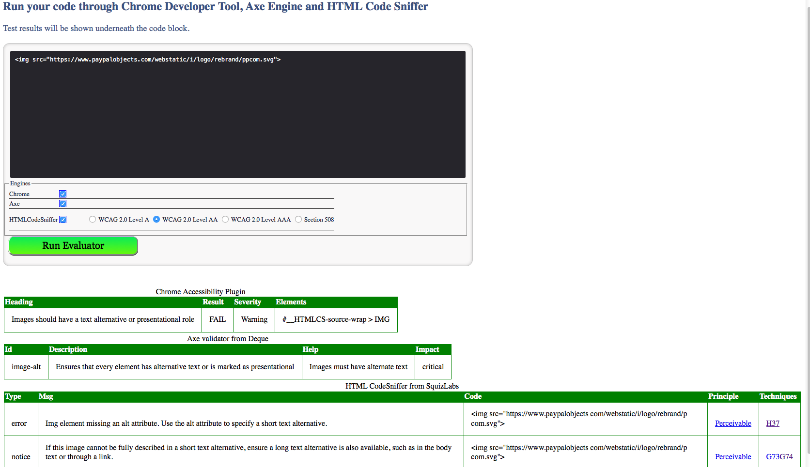

#Quick Check
==========

Quickly Run code through Opensource  Accessibility Test Engines

Automated testing  tools are helpful in identifying common accessibility issues with a minimum amount of effort. There are plenty of testing tools and some of them are open sourced.
This tool quickly evaluates you source code with Chrome Accessibility plugin, HTML Code Sniffer and Deques Axe engine.  All of these engines use client side scripting.  Some of the engines are more precise over other and each has its own advantage.

  
 

##How to get a copy and Run on your system locally
Need to have node install in your system to initialize subodules. 
```sh
$ git submodule init
$ git submodule update
$ node app.js
```

After installation, index.html should be available inside the folder. This doesn't need Node or any other software to run other than you browser. Node is needed only for getting the latest version of testing engines. 

##Known Issues
* Sometimes engines may take more time to evaluate and may not show the results if you choose to run all the engines. 

##Of course, we want feedback!
Please do not hesitate to [raise issues and comment on Github](https://github.paypal.com/accessibility/quickcheck/issues) if something doesn't work or you have ideas on how to improve the script.

##Authors
 - Prem Nawaz Khan, primary developer || [https://github.com/mpnkhan](https://github.com/mpnkhan) || [@mpnkhan](https://twitter.com/mpnkhan)
 
## Copyright and license
 Code released under the [MIT license](LICENSE.md). 
